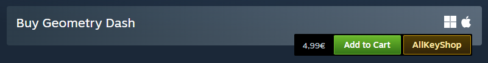
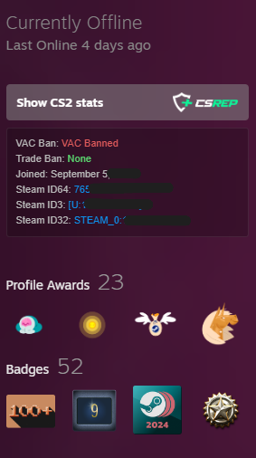

# Steam Essentials

Standalone Tampermonkey userscript that adds practical profile and store-page tools to Steam.

## Screenshots

**Store header actions**

**Purchase actions**

**Profile tools**

## Features

- Adds a CSRep shortcut on Steam profile pages.
- Shows Steam profile details from Steam's XML profile endpoint:
  - VAC ban status
  - Trade ban status
  - Joined date
  - Steam ID64, Steam ID3, and Steam ID32
- Makes Steam IDs clickable to copy.
- Adds an `Open client` button on Steam store app pages using `steam://store/<appId>`.
- Restyles the Steam `Community Hub` button to match the added controls.
- Adds AllKeyShop links near the store page header and purchase actions.
- Adds external rating blocks from GameSpot and GameRankings when available.
- Attempts to bypass Steam store and community age gates by setting mature-content cookies and proceeding through age prompts.

## Install

1. Install a userscript manager such as Tampermonkey or Violentmonkey.
2. Open [`main.js`](./main.js).
3. Copy the script into a new userscript.
4. Save it and visit a supported Steam page.

## Supported Pages

The script runs on:

- `https://steamcommunity.com/id/*`
- `https://steamcommunity.com/profiles/*`
- `https://steamcommunity.com/app/*`
- `https://store.steampowered.com/app/*`
- `https://store.steampowered.com/agecheck/*`
- `https://store.steampowered.com/*/agecheck*`

## Permissions

The userscript metadata requests:

- `GM_xmlhttpRequest` for external rating lookups.
- `@connect www.gamespot.com`
- `@connect www.gamerankings.com`

Steam profile data is fetched from the current Steam profile page with `?xml=1`.

## Development

This repository is intentionally simple:

- `main.js` contains the complete userscript, including embedded visual assets.
- There is no build step.
- Edit `main.js`, then reload or reinstall the userscript in your userscript manager.

## License

MIT, as declared in the userscript metadata.
